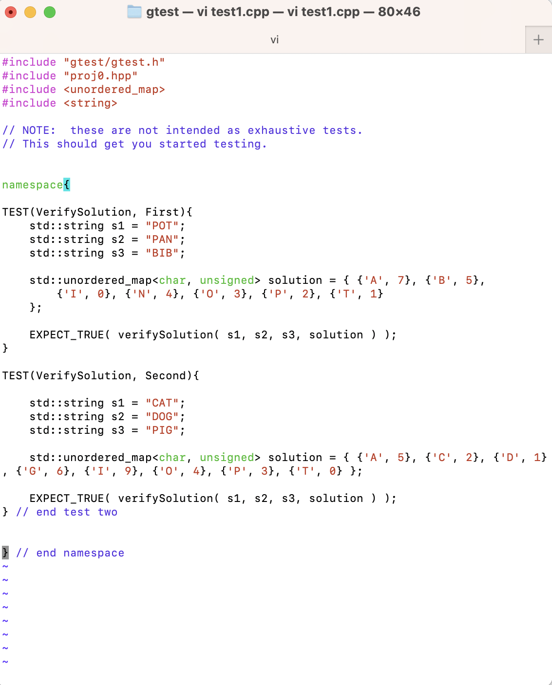
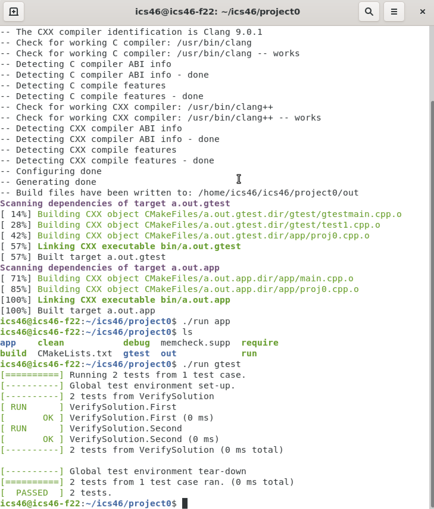

### Desciption:

This project is about writing a function VerifySolution(s1,s2,s3, mapping) that checking if the sum of the two words are equal to the third word or not. Each character in the word is corresponding with a digit in the provided map. If the result is equal, we return true. Otherwise, return false.

### Screenshots:

